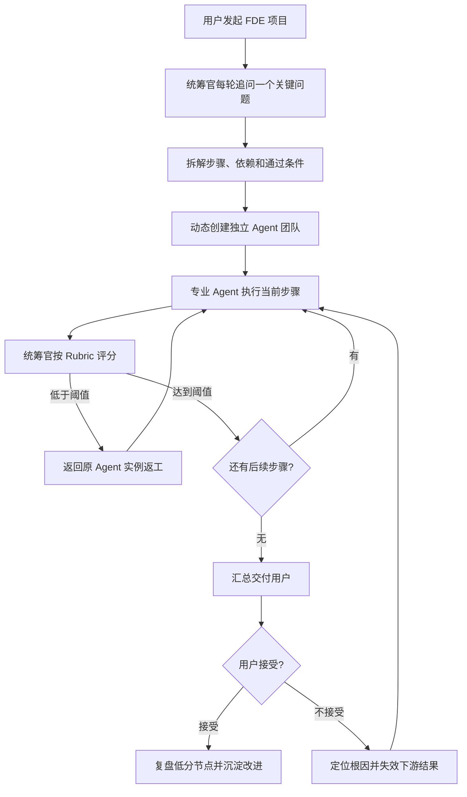

# FDE Agent Team

> 把一支能够理解业务、动手落地、独立质检并持续复盘的 FDE 咨询团队，装进你正在使用的 Agent 工具里。

FDE Agent Team 不是九张角色提示词，也不是“让一个大模型轮流扮演九个人”。它是一套可运行、可评分、可返工、可追踪的 AI 咨询交付系统：用户只面对团队统筹官，统筹官澄清真正问题、动态组建独立 Agent 团队、规划依赖路径，并让每一步经过质量门后再继续。

## 它真正解决什么问题

很多 Agent 演示看起来像团队，实际仍是同一个上下文中的角色扮演：需求没有形成可验证基线，执行结果无人独立审查，失败以后不知道退回哪一步，换一个宿主工具后流程又完全变样。

本项目把这些问题变成程序化约束：

- **从模糊想法到真实需求**：统筹官采用苏格拉底式追问，每轮只问一个关键问题，直到业务结果、使用者、成功指标、约束和证据来源清楚。
- **真正独立的执行团队**：每个角色拥有独立实例 ID、上下文、任务队列、工作状态和产出流；统筹官不能把自己的内容伪装成专业 Agent 产出。
- **每一步都可验收**：步骤必须声明预期产出、通过条件和风险等级；统筹官按统一 Rubric 评分，低分产出返回原 Agent 实例返工。
- **用户不满意能够精确回退**：统筹官必须定位根因步骤，系统使该步骤及其所有下游结果失效，保留历史后重新执行。
- **中断后仍能继续且记录可信**：项目状态采用原子快照、CAS 和幂等转换；关键状态事件形成可验证哈希链，不依赖模型“记得自己做过什么”。
- **换宿主不换质量标准**：Claude Code、Codex、Gemini CLI、OpenClaw、Hermes 等只负责提供执行能力；评分、状态、回退和审计由同一个 portable kernel 强制。
- **交付的是业务结果**：调研、需求、方案、原型、质量、合规、知识沉淀和复盘在同一条交付链上，不停留在聊天回答。

## 一条完整的 FDE 交付 Loop



默认通过线为低风险 75、中风险 80、高风险 90；每步默认最多返工 3 次。完整规则见 [Loop Workflow v2.2](docs/loop-workflow-v2.2.md)。

## 九个角色，不是九个称呼

| 角色 | 责任 | 明确边界 |
|---|---|---|
| FDE Lead / 团队统筹官 | 澄清、拆解、组队、评分、交付和回退 | 只编排，不代替专业角色生产产出 |
| Echo Agent | 用户洞察、需求分析、信息去噪、需求追踪 | 不写实现代码 |
| Delta Agent | 技术选型、原型、代码与逆向检查 | 不替 QA 审核自己 |
| Productize Agent | 交付物、知识沉淀、模板化和复盘 | 不负责实现与独立质检 |
| Research Agent | 行业、竞品、技术与证据调研 | 不把未验证信息写成事实 |
| Knowledge Curator | 分类体系、标签、归档和知识结构 | 管结构，不伪造内容 |
| QA Agent | 风险 Panel Review、证据认证和质量门 | 独立于生产链 |
| Legal Agent | 合同、隐私、数据、IP 和产品合规分流 | 不替代执业律师作最终意见 |
| Coach Agent | 团队评估、流程复盘和模型行为审计 | 不参与被评估产出的生产 |

## 主流 Agent 兼容性

我们不宣称所有 Agent 工具原生能力相同。项目采用“宿主原生能力 + portable kernel”的组合来保证执行契约一致。

| 优先级 | 平台 | 运行方式 |
|---|---|---|
| P0 | Claude Code | 原生 Agent Teams / subagents + FDE Loop 内核 |
| P0 | OpenAI Codex | 并行线程、隔离 worktree、skills + FDE Loop 内核 |
| P0 | Gemini CLI | 自定义 subagents、工具策略 + FDE Loop 内核 |
| P0 | GitHub Copilot CLI / SDK | custom agents、subagent events + FDE Loop 内核 |
| P0 | OpenCode | primary/subagents、Task 权限 + FDE Loop 内核 |
| P0 | OpenClaw | 隔离 Agent、后台 subagents、持久 session + FDE Loop 内核 |
| P0 | Hermes Agent | 并行委派、隔离终端 session + FDE Loop 内核 |
| P0 | WorkBuddy | teammate feature probe + FDE Loop 内核 |
| P1 | LangGraph、Google ADK、OpenAI Agents SDK、Microsoft Agent Framework、CrewAI | 可编程编排后端 |
| P1/P2 | Cursor、Dify | 后台 Agent 或 Workflow API 桥 |

详细的官方证据、限制和适配决策见 [主流 Agent 宿主兼容性调研](docs/compatibility-research-2026-07.md)。机器可读能力表位于 [host-capabilities.json](config/host-capabilities.json)。

### 查看兼容矩阵

```bash
python -m adapters.compatibility.cli matrix
python -m adapters.compatibility.cli check --host claude_code
```

### 为目标宿主生成角色包

```bash
python -m adapters.compatibility.cli install \
  --host claude_code \
  --target /path/to/your/project
```

支持生成原生或兼容角色定义的宿主包括：`claude_code`、`gemini_cli`、`github_copilot`、`opencode`、`codex`、`hermes_agent`、`openclaw`、`workbuddy` 和 `cursor`。

安装器默认拒绝覆盖已有文件。确认要替换时必须显式使用 `--mode overwrite`，避免破坏用户已经存在的规则、角色和个人数据。

## 跨宿主一致性如何实现

```text
team.yaml（角色与边界）
        │
        ├── CompatibilityCompiler ──> 各宿主角色文件 / host manifest
        │
        └── Portable Kernel
              ├── AgentTeamRuntime：独立实例、队列和身份
              ├── ProjectCoordinator：规划、委派和自动推进
              ├── LoopOrchestrator：评分、返工、验收和回退
              ├── AtomicJsonStateStore：原子状态、CAS、幂等与审计链
              └── JsonCommandBridge：统一 JSON 工作信封
```

无论宿主使用原生 teammate、subagent、后台任务还是外部 API，每个工作节点都必须返回同一种工作信封：产出、证据引用和约束遵循声明。纯文本“我已经完成”不能通过桥接层，更不能绕过评分门。

## 飞书：用户只面对一个统筹官，背后是一支独立团队

飞书只安装一个团队统筹官机器人。统筹官创建项目群、加入用户、创建并绑定全部独立 Agent 实例、发布团队名册，并以“角色名 + Agent 实例签名”转发每个 Agent 的消息。

```powershell
python -m adapters.feishu.team_cli bootstrap `
  --config config/feishu-team.example.json `
  --project-id fde-customer-onboarding `
  --name "FDE｜客户入驻提效" `
  --owner-open-id ou_owner
```

飞书原生成员列表中只有一个机器人，这是产品约束；专业角色仍是运行时中的独立 Agent，而不是统筹官的一组提示词。详见 [飞书一键导入指南](docs/feishu-one-click-import.md)。

## 快速开始

```bash
git clone https://github.com/digibeing1001/fde-agent-team.git
cd fde-agent-team

# 查看适配能力
python -m adapters.compatibility.cli matrix

# 运行新增核心测试
python tests/p10_loop_orchestrator_test.py
python tests/p11_feishu_team_cli_test.py
python tests/p12_project_coordinator_test.py
python tests/p13_compatibility_contract_test.py
python tests/p14_durable_state_test.py
```

然后向 FDE Lead 描述一个 FDE 类型的咨询项目，例如：

```text
我们希望把企业客户从签约到第一次上线的周期缩短 30%，请组建团队推进。
```

Lead 不会立即编造方案，而是先逐轮澄清关键上下文，再提交带依赖、产出和评分标准的执行路径。

## 核心目录

```text
fde-agent-team/
├── team.yaml                              # 平台无关的角色单一真相源
├── agents/                                # Lead + 8 个专业 Agent
├── adapters/
│   ├── agent_team_runtime.py              # 独立 Agent 实例
│   ├── project_coordinator.py             # 自动规划和执行协调
│   ├── loop_orchestrator.py               # 评分、返工与用户反馈 Loop
│   ├── durable_state_store.py              # 原子状态、CAS 与哈希链审计
│   ├── compatibility/                     # 跨宿主能力表、编译器和 JSON 桥
│   └── feishu/team_cli.py                 # 飞书一键导入与项目启动
├── config/
│   ├── host-capabilities.json             # 主流 Agent 能力矩阵
│   ├── loop-policy.json                   # 评分策略
│   └── feishu-team.example.json           # 飞书团队配置示例
├── docs/                                  # 架构、调研和部署文档
└── tests/                                 # 原有回归 + Loop/飞书/兼容性契约测试
```

## 我们保证什么，不保证什么

保证：在仓库 portable kernel 和适配器路径内，步骤状态、评分、返工、用户回退和审计的数据契约一致；单机运行时可使用原子快照、CAS、幂等索引和哈希链，并由 Python 3.11/3.12 CI 持续验证。耐久边界见 [FDE 耐久运行时](docs/durable-runtime.zh-CN.md)，安全边界见 [SECURITY.md](SECURITY.md)。

不虚假保证：官方文档适配不等于所有产品版本、账户权限和操作系统已经现场认证。尤其是实验功能、私有产品和快速迭代的 CLI，安装时仍需执行 capability probe 和 smoke test。发现宿主缺少硬能力时，系统应 fail closed，而不是降级成看似成功的角色扮演。

## License 与责任边界

- 项目角色、运行时和技能文件为原创实现；外部项目仅作为方法和兼容性研究来源。
- Legal Agent 只提供风险识别与审查草稿，不替代执业律师。
- 接入外部模型、Agent、MCP 或企业系统时，使用者负责相应的数据权限、保留策略、费用和合规边界。
