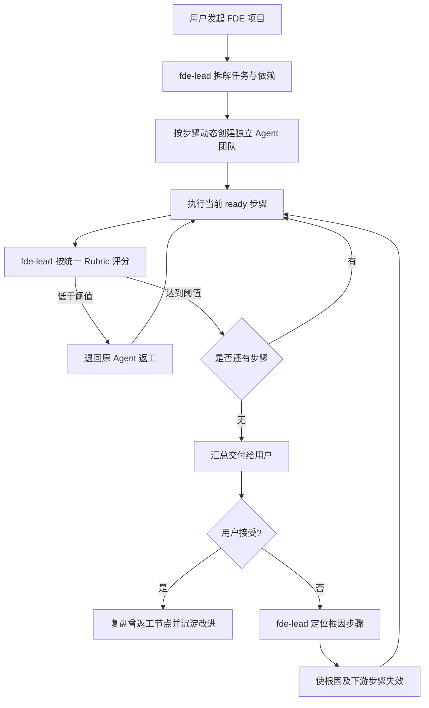

# FDE Agent Team Loop Workflow v2.2

## 目标

把“拆解—执行—评分—返工—交付—用户反馈”从提示词约定升级为可持久化、可审计的状态机。`fde-lead` 只负责规划、组队、评分、定位问题与交付，不替执行 Agent 生产专业产出。

## 主流程



## 硬门控

- 每个步骤必须声明执行 Agent、依赖、预期产出、通过条件和风险级别。
- 每次产出必须经过 `fde-lead` 评分，其他角色不能绕过门控。
- 统一 Rubric：目标一致性 25%、完整性 20%、证据 15%、执行质量 20%、安全合规 10%、用户约束 10%。
- 通过线：低风险 75，中风险 80，高风险 90。
- 默认每步最多允许 3 次返工；超限后进入 `blocked`，只有人类显式扩展预算才能恢复。
- 用户不满意时必须给出根因步骤，系统保留历史产出并使该步骤及全部下游步骤失效。
- 用户接受后，只对曾低分或返工的节点创建复盘项。

## 状态与审计

运行状态：`planned → running → awaiting_user_acceptance → accepted`，任何步骤超出返工预算可进入 `blocked`。

步骤状态：`pending → ready → running → scoring → passed`；评分失败进入 `rework`，再次从同一 Agent 执行。

`adapters/loop_orchestrator.py` 会持久化：每步状态、Rubric 明细、加权分、返工次数、尝试次数、失效次数、最终通过情况、用户反馈与有序事件日志。数据结构见 `docs/loop-run-schema.json`，策略见 `config/loop-policy.json`。

## 集成接口

宿主只需提供已有的 `StateStore` 协议：

```python
store.get(project_id, key)
store.set(project_id, key, value)
```

执行器调用顺序：`create_run` → `start_step` → `submit_step_result` → `score_step`。所有步骤通过后调用 `record_user_feedback`；拒绝时必须传 `root_cause_step_ids`。
